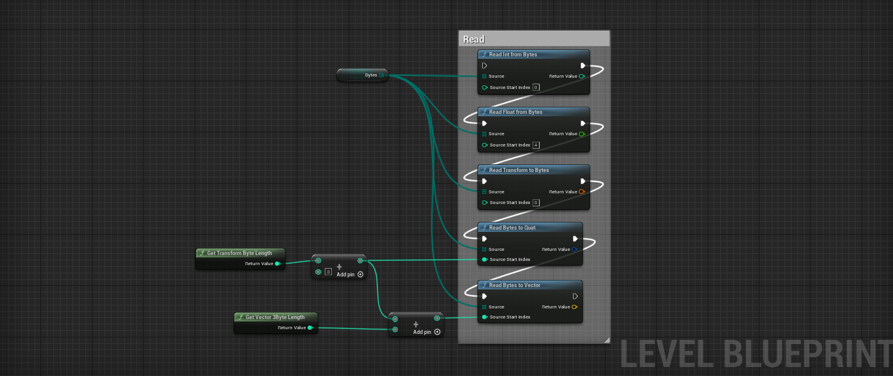
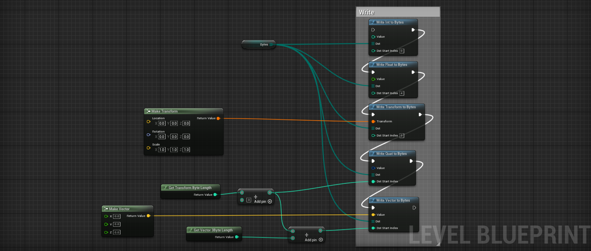

# Binary Serialization

Unreal Engine 5 Plug-in to serialize variables into binary.

It is utility to serialize and send data over TCP or UDP.

## How to use

Allocate a byte array, specify an index, and read/write.

### Supported Types

- Int32
- Float
- Vector3
- Transform
- Quatenion

## License

The license is MIT license.

## Contributers

- [umetaman](https://github.com/umetaman)